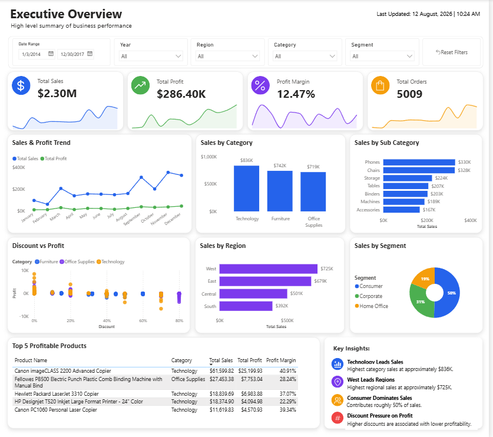

# Business Performance & Profitability Analytics

An interactive Power BI dashboard built to analyze business performance across sales, profitability, products, regions, customer segments, and discount behavior.

## Dashboard Preview



## Project Objective

The goal of this project is to transform transactional business data into an interactive management dashboard that helps identify performance trends, profitable areas, and potential business risks.

## Key Analysis

- Overall Sales, Profit, Profit Margin, and Order performance
- Monthly Sales & Profit trends
- Category and Sub-category performance
- Regional Sales comparison
- Segment-wise Sales distribution
- Discount vs Profit relationship
- Top profitable products

## Tools & Technologies

- Power BI
- Power Query
- DAX

## Technical Implementation

- Data cleaning and transformation with Power Query
- Calendar table and data modeling
- DAX measures for key business metrics

## Key Insights

- Technology generates the highest category sales at approximately $836K.
- West region records the highest sales at approximately $725K.
- Consumer segment contributes roughly 50% of total sales.
- Higher discounts are associated with lower profitability.

## Dataset

Source: [Kaggle – Superstore Dataset](https://www.kaggle.com/datasets/vivek468/superstore-dataset-final)

## Project Structure

```text
├── dataset/
├── dashboard/
├── screenshots/
└── README.md
```
The `screenshots/` folder includes the final dashboard preview and the Power BI data model.

## Dashboard File

The Power BI `.pbix` file is available in the [dashboard](dashboard/) folder.